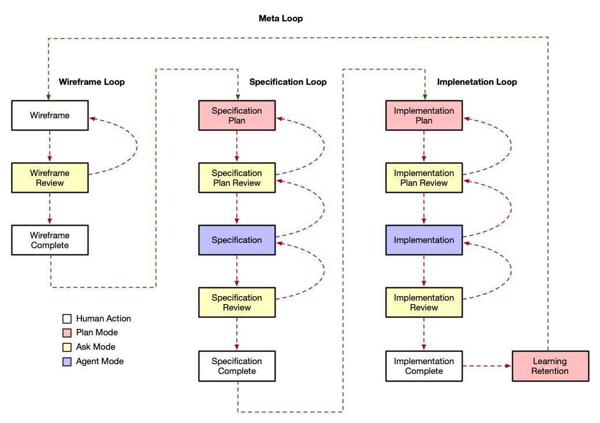

# Software Development Process with Agentic Interfaces

> **Summary:** This document describes a "meta loop" where a single experienced developer collaborates with AI coding agents (like Claude Code) to achieve **single-shot repeatability and transferability**—the ability to deliver production-ready software in one attempt, reproducibly, across different platforms. The process flows through three loops (Wireframe → Specification → Implementation), each using four modes: **Human Action** (manual work), **Plan Mode** (AI creates structured plans), **Ask Mode** (AI reviews and provides feedback), and **Agent Mode** (AI executes the plan). The key insight is "delete and regenerate"—when errors occur, artifacts are deleted rather than patched, and the *documentation* is improved so the AI can regenerate correctly. This inverts traditional economics: code becomes cheap to regenerate while documentation becomes the persistent value that preserves learning across sessions.

## Introduction

The goal of this software development process (meta loop) is for a single developer (the user) collaborating with one or more AI coding agents to deliver high-quality production-ready software applications and systems efficiently.

In this context "AI coding agent" means an agentic interface to a family of frontier models trained, fine-tuned, system prompted, with interfaces to software development capabilities. An "agentic interface" has action capabilities, observation capabilities, variable autonomy, and a "loop" ( a "while loop" with tool execution and context accumulation repeats until there is a reason to stop). The success and failure of AI coding is tied up in helping the agent understand what the (1) tasks is, (2) how to accomplish it, and (3) the "definition of done". Ironically 1, 2, and 3 are problems that have plagued software development from the beginning. There are no good answers as every software development team's understanding of 1, 2, and 3 are subjective and changing and not objective and fixed. Even with specs, plans, and tests, 1, 2, and 3 are fuzzy. This is because a map is not the territory, no plan survives meeting the enemy, and "done", like beauty, is in the eye of the beholder.

The real break through for that AI coding brings to the table is human-equivalent labor that is orders of magnitude more efficient than pure human labor. Prior to AI the agent was a team composed of people and the "loop" was one of the many variations of the SDLC (Software Development Life Cycle). This is still the case except that now one or more of the team member who provide labor to the team are agentic interfaces with software development capabilities like Claude Code, Codex, Gemini Code Assist, and Amazon Q Developer. These agentic interfaces enable specs, plans, and tests to be written and rewritten until they are "done" at very low cost and in a very short time. A single designer/architect/engineer/product/project manager working with an agentic interface can produce the labor of an entire SDLC team. Metaphorically the software development process of human oversight with agentic interfaces can be thought of a fleet of self-driving cars under the leadership of a single driver.

```ascii
┌─────────────────────────────────────────────────────────────┐
│                    SINGLE-SHOT DELIVERY                     │
├─────────────────────────────────────────────────────────────┤
│  ┌──────────────┐  ┌──────────────┐  ┌──────────────┐       │
│  │  Wireframe   │──│     Spec     │──│    Code      │       │
│  │   (Visual)   │  │   (Written)  │  │  (Working)   │       │
│  └──────────────┘  └──────────────┘  └──────────────┘       │
│         │                 │                 │               │
│         ▼                 ▼                 ▼               │
│  ┌──────────────────────────────────────────────────┐       │
│  │           External Documentation                 │       │
│  │  (Agent Files, TODOs, READMEs, Architecture)     │       │
│  └──────────────────────────────────────────────────┘       │
└─────────────────────────────────────────────────────────────┘
```

Now that we understand the goal and how the user and the agent work together we can refine and specify the goal: Single-shot repeatability and transferability. A "single-shot" means in a single attempt the user and agent can deliver software that is "done". "Repeatability" means that the user and agent can deliver that same software repeatedly without variability. "Transferability" means that the user and agent can change the target platform (i.e. delivering Java software or Python software instead of Swift software) and still deliver in a single-shot. This refined goal is the ideal goal for 100% human teams. If all were practical and economical, all software would be delivered in this deterministic, repeatable, and transferable way. Its why we write specs, plan, and test in the first place. Its why we follow best practices and argue about the mutability of variables and the design of reusable component libraries. Alas, the SDLC takes so much time and labor and requirements change so quickly that most, if not all, software development projects are delivered late, full of unique shortcuts, and are designed for specific platforms.

The rest of this document is software development process (a meta loop) that empowers a single developer collaborating with one or more AI coding agents to achieve these goals.

## Prerequisite

In order for the software developer to operate the meta loop and effectively collaborate with AI coding agents the following prerequisites must be in place:

1. Sufficiently Experienced Developer

   A sufficiently experienced developer (designer/architect/engineer/product/project manager) for the task at hand. This is an extension of the idea of a "full stack" developer. Full stack here means not just the technical stack but the design, architecture, product, and project aspects as well. Likely candidates are professionals with a technical background and several years of experience working with stakeholders and managing teams members. The ideal candidate will have had deep exposure to collecting requirements, planning delivery, architecting, engineering, testing, and deploying software in one or more "platforms". A platform here means AWS, GCP, Wordpress, Apple, Android, Web, Unreal Engine, Godot, SAP, .NET, etc... It is unlikely that a single person has direct experience in all these platforms but AI agents will make the developer's skills transferable from one platform to another with additional help from local subject matter experts.

2. Sufficiently Powerful AI Coding Agent

    Currently Claude Code is the benchmark "agentic interface to a family of frontier models trained, fine-tuned, system prompted, with interfaces to software development capabilities". Codex, Gemini Code Assist, and Amazon Q Developer are not far behind. This benchmark has less to do with how "smart" the AI is and more to do with how well trained, fine-tuned, system prompted, and augmented with capabilities with which the AI coding agent is empowered. Ultimately which agent is "best" may mostly depend on the developer's experience. The more a developer works with a particular agent the better that developer is at writing specs, plans, and tests to drive that agent.

3. Sufficiently Build-Oriented Mission

    Not every task in the SDLC is ideal for an agentic interface. AIs based on large language models are best at discrimination (reading), generation (writing), and transformation (translation). Thus AI coding agents are a low cost solution to the problem of building software and a high cost solution to observing software in real time. Our popular AIs (Claude, ChatGPT, Gemini) are not good at executing, they don't persist, and they are poor at verification (humans are good at what AIs are bad at). Thus, at least as of this writing, the job for an AI is building a software project not observing it in production and making sure it is working as intended.

## Key Concepts

### Why Delete & Regenerate?

The cost structure of AI development inverts traditional software economics:

| Traditional                          | AI-Assisted                           |
| ------------------------------------ | ------------------------------------- |
| Code is expensive to write           | Code is cheap to regenerate           |
| Documentation often skipped          | Documentation is the persistent value |
| Knowledge lives in developers' heads | Knowledge is easily externalized      |
| Iteration is costly                  | Iteration is nearly free              |

Note: _Learning is preserved in the documentation, not in the code_

### The Goal: Single-Shot Repeatability & Transferability



### The Four Modes

| Mode             | Color  | Purpose                                | When to Use                                |
| ---------------- | ------ | -------------------------------------- | ------------------------------------------ |
| **Human Action** | White  | Developer performs manual work         | Drawing wireframes, confirming completion  |
| **Plan Mode**    | Pink   | AI creates structured plan             | Before writing specs, docs, or code        |
| **Ask Mode**     | Yellow | AI asks questions, provides feedback   | Reviewing wireframes, plans, specs, code   |
| **Agent Mode**   | Blue   | AI executes the plan                   | Writing specs, code, or docs               |

Note: _An agentic interface may not formally have all four modes. A missing mode can be created as a custom skill and will be invoked by the agent when you instruct it to ask, plan, or act._

### Iteration Pattern

The red dashed arrows in the diagram represent **iteration loops**. When a review step identifies issues:

1. The erroneous artifact (spec or code) is **deleted, not patched**
2. The developer updates the **source documentation** (wireframe, spec, or codebase docs) to make instructions clearer
3. The process **loops back** to the planning step
4. The AI regenerates the artifact from the improved documentation

This "delete and regenerate" pattern preserves learning in documentation rather than in accumulated patches.

## The Meta Loop

### 1. Wireframe Loop

#### 1.1 Wireframe `[Human Action]`

The developer draws a picture, a diagram, or visualization of the task at hand. It may be a flow chart, a screen, an architectural diagram. The picture is a simplified schematic with just enough detail to visually explain the task. Precise sizing, placement, connections, and scoping is not required and hurts the process. The AI is good at discrimination and too many details too early is a waste of time and leads to constrained, suboptimal outcomes. This initial step is akin to drawing an idea on the whiteboard.

> 💡 **Best Practice:** Break down complex wireframes into component wireframes. Any element that appears multiple times or in multiple wireframes should be treated as a component with its own separate wireframe. This ensures code reuse, better context window management, and fewer tokens.

#### 1.2 Wireframe Review `[Ask Mode]`

The developer uses a prompt (or better a skill) to ensure the AI understands the meaning of the picture and its application to the problem at hand and the constraints of the platform. The developer should instruct the AI to provide specific feedback and not ask general questions. For example "Review this wireframe as the basis for a SwiftUI view" is better than "What do you think of this wireframe?". Instructions set context and constrain the AI to think in specifics.

The developer doesn't explain the diagram to the AI. Instead, the developer updates the wireframe until the AI understands it in a "single shot".

> ⚠️ **Avoid Over-Specification:** Sometimes the AI will suggest that the wireframe contains implementation details, sizing, and other specifics. This should be avoided. The wireframe is not the spec—it is a tool that the AI will use to generate the spec.

**If review fails:** Update the wireframe and return to step 1.1.

#### 1.3 Wireframe Complete `[Human Action]`

Once the developer confirms that the wireframe is understood by both the human and the AI, clear the context and move on to the Specification Loop.

---

### 2. Specification Loop

#### 2.1 Specification Plan `[Plan Mode]`

The developer instructs the AI to "enter plan mode" and create a plan for writing a specification based on the wireframe and the current codebase/platform.

The plan should outline:

- What sections the spec will contain
- Which existing patterns/components to reference
- Any architectural decisions to address

#### 2.2 Specification Plan Review `[Ask Mode]`

The developer reviews the plan and interrogates the AI. This interrogation will prompt the AI to improve its plan.

Questions to consider:

- Does the plan address all elements in the wireframe?
- Is the scope appropriate (not too broad, not too narrow)?
- Are the right existing patterns being referenced?

**If review fails:** Return to step 2.1 to revise the plan.

#### 2.3 Specification `[Agent Mode]`

Once the developer finds the plan acceptable, they instruct the AI to enter "agent mode" and write the specification based on its plan.

The AI generates the complete specification document.

#### 2.4 Specification Review `[Ask Mode]`

The developer reviews the specification and looks for deviation from the wireframe, the current codebase, or the platform. The developer must not directly correct the specification. Instead, the developer must interrogate the AI about the deviations.

For each deviation, the developer:

- Updates the wireframe (to make visual instructions clearer), OR
- Directs the AI to update the codebase's documentation

The erroneous spec is **deleted** and the process loops back to 2.1—the learning is preserved in the updated wireframes and documentation, not in the discarded spec itself.

**If review fails:** Delete the spec and return to step 2.1.

> 💡 **Best Practice:** A codebase needs extra-specification documentation that describes architectural and implementation strategies. These documents include READMEs, CONSTITUTIONs, SHARED-PATTERNs, ARCHITECTURAL-DECISIONs, and AGENTs (or equivalent) files. A spec should be short and specific to a single feature, screen, or service. The AI is perfectly capable of writing and maintaining these documents.

> 📝 **Context Management:** Clear the context often so that project knowledge is externalized to documentation and not hidden in the current context. Clear the context after completing this loop.

#### 2.5 Specification Complete `[Human Action]`

Once the developer confirms that the specification is correct and can be generated in a "single shot" from the wireframe, clear the context and move on to the Implementation Loop.

---

### 3. Implementation Loop

#### 3.1 Implementation Plan `[Plan Mode]`

The developer instructs the AI to "enter plan mode" and create a plan for implementing the specification based on the wireframe and the current codebase/platform.

The plan should outline:

- Which files will be created or modified
- The order of implementation steps
- Testing strategy

#### 3.2 Implementation Plan Review `[Ask Mode]`

The developer reviews the plan and interrogates the AI. This interrogation will prompt the AI to improve its plan.

Questions to consider:

- Does the plan follow the specification exactly?
- Are the implementation steps in the right order?
- Is the testing strategy adequate?

**If review fails:** Return to step 3.1 to revise the plan.

#### 3.3 Implementation `[Agent Mode]`

Once the developer finds the plan acceptable, they instruct the AI to enter "agent mode" and write the implementation based on its plan.

The AI generates the code, tests, infrastructure, and configurations.

> 💡 **Best Practice:** Implementation includes code, tests, infrastructure, and configurations. A good implementation is a complete and independent "package" that can be integrated or deployed in isolation of the rest of the system that the feature, screen, or service is supporting (ideally).

#### 3.4 Implementation Review `[Ask Mode]`

The developer reviews the implementation and looks for deviation from the specification, wireframe, the current codebase, or the platform. The developer must not directly correct the implementation. Instead, the developer must interrogate the AI about the deviations.

For each deviation, the developer:

- Instructs the AI to update the specification, OR
- Updates the wireframe, OR
- Directs the AI to update the codebase's documentation

The erroneous implementation is **deleted** and the process loops back to 3.1.

**If review fails:** Delete the implementation and return to step 3.1.

> 📝 **Don't Fear Deletion:** Don't worry about "throwing work away" as the cost of the AI regenerating work is near zero while the cost of not retaining knowledge is losing single-shot repeatability and transferability.

#### 3.5 Implementation Complete `[Human Action]`

Once the developer confirms that the implementation is correct and can be generated in a "single shot" from the specification, clear the context and move on to Learning Retention.

---

### 4. Learning Retention `[Plan Mode]`

After a feature, screen, or service is successfully completed in a single-shot, instruct the AI to enter plan mode and create a plan to update its agent and TODO files with any knowledge it needs to retain for the next session.

**Agent files** (such as CLAUDE.md or similar) are configuration files that persist instructions, context, and preferences for the AI across sessions.

**TODO files** track pending tasks, completed work, and session notes.

Together, these files serve as the AI's external memory.

> ⚠️ **Context Window Warning:** Make sure the AI doesn't put too much specific project knowledge in its agent file because these files eat up context window and get rewritten. The info in an agent file is not retained in the long run—use separate documentation files for detailed knowledge.

Once the developer is happy with the plan, they can instruct the AI to enter agent mode to update and maintain all extra-specification documentation including a TODO file that it updates with every step in this loop and at the end of every session.

The developer should also keep a **USER-NOTEBOOK** that logs any issues and workarounds encountered during this process. You can instruct the AI to review the USER-NOTEBOOK and suggest improvements to documentation and process.

It is the responsibility of the developer to use agent mode, plan mode, and ask mode strategically and ensure nothing of importance is lost when context is cleared.

---

### 5. Repeat

Take a break, exit the CLI, and return to step 1 when you're ready for the next feature, screen, or service.
